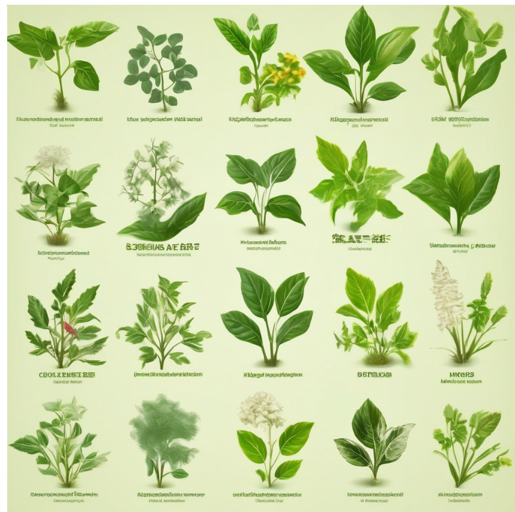
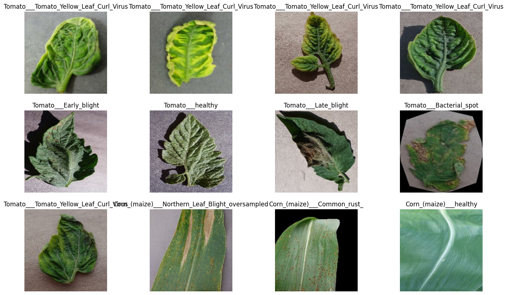
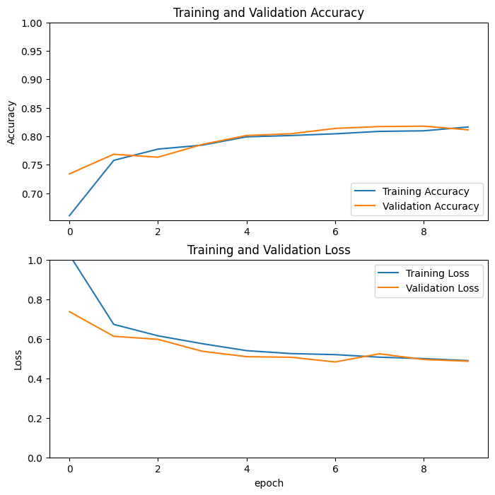
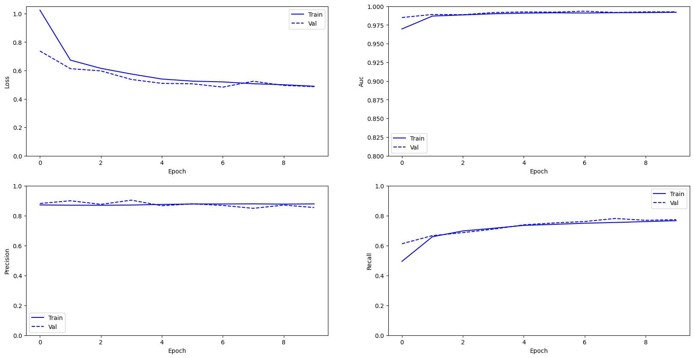
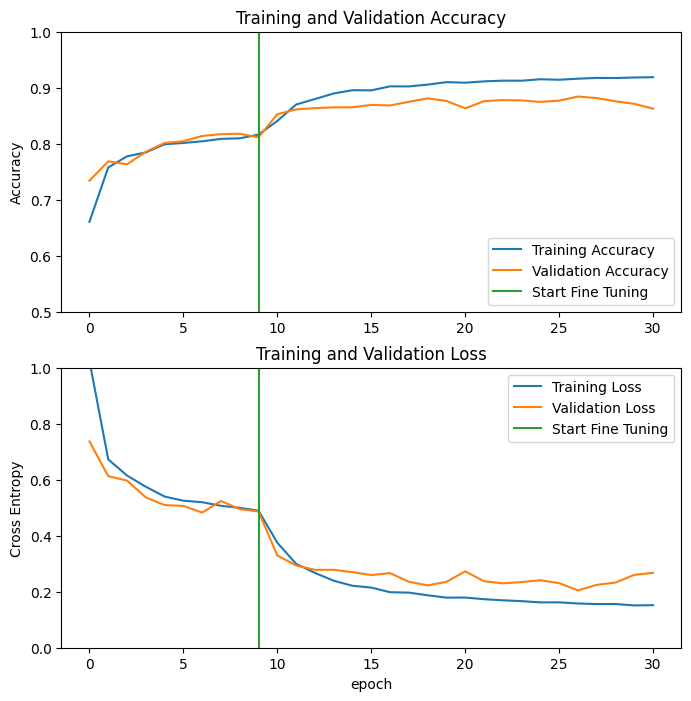
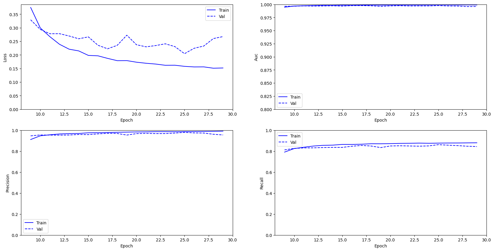

# Capstone--Lazarus
      

### Authors: [Brandon Abuga](https://github.com/brandonbush2), [Daniel Wanjala](https://github.com/MadScie254),[Bill Kisuya](https://github.com/Musikari),[John Muriithi](https://github.com/johnmuriithikamau), [Vanessa Mwangi](https://github.com/vanessamuthonimwangi),Caren Chepkoech, Sandra Luyali

## Overview
Agriculture, the cornerstone of global food security, faces a perennial challenge in the form of plant diseases, which adversely impact crop yield, quality, and economic sustainability. One of the critical factors in mitigating these challenges lies in the early detection and accurate classification of diseases affecting plant leaves. Traditionally, disease diagnosis has been a labor-intensive and time-consuming process, often relying on manual inspection by agricultural experts. However, as technology advances, leveraging the power of machine learning and computer vision techniques presents an unprecedented opportunity to revolutionize this essential aspect of agriculture.

## Problem Statement

Kenya, like many countries, heavily relies on agriculture as a key contributor to its economy, food security, and the livelihoods of its people. However, the agricultural sector in Kenya faces several challenges, including the accurate classification of plant species and the early detection of diseases affecting crops. These challenges have a significant impact on crop yield, food production, and overall agricultural sustainability. As such, there is a pressing need for the development and implementation of an AI-based solution to address these issues.

**Justifications**:

1. **Food Security**: Agriculture is the backbone of Kenya's economy, providing livelihoods for millions of people and ensuring food security. Accurate plant species classification and disease detection are essential for maintaining a stable food supply.

2. **Economic Impact**: Crop diseases and misidentification of plant species result in substantial economic losses for Kenyan farmers. An AI solution can mitigate these losses and improve the income of farmers.

3. **Environmental Sustainability**: Accurate plant species classification and disease detection contribute to sustainable agriculture by reducing the overuse of pesticides and enabling more precise resource management.

4. **Labor Shortage**: Kenya's agricultural sector faces challenges related to labor shortages, especially during peak farming seasons. Automation through AI can help bridge this gap.

5. **Data Availability**: Kenya has a rich diversity of plant species and a wide range of diseases affecting crops. Leveraging AI on local data can lead to more accurate and context-specific solutions.

**Stakeholders**:

1. **Farmers**: Small-scale and large-scale farmers in Kenya are primary stakeholders. They benefit from increased crop yield, reduced losses, and improved income through accurate plant species classification and disease detection.

2. **Government**: The Kenyan government has a vested interest in enhancing food security, economic development, and sustainability. They may support and regulate the adoption of AI technologies in agriculture.

3. **Agricultural Organizations**: NGOs and agricultural research institutions in Kenya can collaborate to provide expertise and resources for the project.

4. **AI Developers and Data Scientists**: Professionals with expertise in AI and data science will be instrumental in developing the AI models and algorithms.

5. **Agricultural Experts**: Agronomists, plant pathologists, and experts in agriculture will provide domain-specific knowledge and validation for the AI system.

6. **Consumers**: Improved agricultural sustainability benefits consumers through a stable food supply and potentially lower food prices.

7. **Local Communities**: Rural communities in Kenya, where agriculture is a primary source of income, will benefit from the project's success.

8. **Environmental Organizations**: Organizations focused on environmental conservation and sustainability have a stake in reducing the environmental impact of agriculture.

9. **Funding Agencies**: Investors and funding agencies that support agricultural innovation and sustainability projects will play a crucial role in project development.

**Stakeholders**:

1. **Farmers**: Small-scale and large-scale farmers in Kenya are primary stakeholders. They benefit from increased crop yield, reduced losses, and improved income through accurate plant species classification and disease detection.

2. **Government**: The Kenyan government has a vested interest in enhancing food security, economic development, and sustainability. They may support and regulate the adoption of AI technologies in agriculture.

3. **Agricultural Organizations**: NGOs and agricultural research institutions in Kenya can collaborate to provide expertise and resources for the project.

4. **AI Developers and Data Scientists**: Professionals with expertise in AI and data science will be instrumental in developing the AI models and algorithms.

5. **Agricultural Experts**: Agronomists, plant pathologists, and experts in agriculture will provide domain-specific knowledge and validation for the AI system.

6. **Consumers**: Improved agricultural sustainability benefits consumers through a stable food supply and potentially lower food prices.

7. **Local Communities**: Rural communities in Kenya, where agriculture is a primary source of income, will benefit from the project's success.

8. **Environmental Organizations**: Organizations focused on environmental conservation and sustainability have a stake in reducing the environmental impact of agriculture.

## Data Understanding
In our project about maize, tomato, and potato plants, we've looked closely at the pictures we have. We understand that these plants have different kinds of leaves, and sometimes these leaves can get sick. For example, maize leaves can look different when they are young compared to when they are grown up. Tomatoes have different-sized leaves and colors, while potato leaves can be smooth or have marks on them. We know that these pictures show not just plants but also signs of diseases. Some leaves might change color or have spots, while others might look weak and droopy. These pictures help us learn how to tell if a plant is healthy or sick. By studying these images carefully, we hope to create a smart system that can look at plant leaves and tell farmers if their plants are in good health or if they need help.

As we dig deeper into our dataset, we recognize the stories these images tell. Each picture captures a moment in the life of a plant, reflecting its health and vitality. We acknowledge the diversity not only in the plants but also in the environments they grow in. Some leaves might be under bright sunlight, while others could be in the shade. These factors can influence how diseases appear, and understanding these intricacies is vital. We take note of the different angles and lighting conditions, as these elements can impact how our smart system interprets the images. By appreciating these details, we can fine-tune our technology to work accurately in various situations, ensuring its usefulness for farmers everywhere.

Additionally, we are mindful of the challenges our dataset might present. Some images might be clearer than others, and diseases can sometimes be subtle, making them hard to detect. We acknowledge these hurdles and view them as opportunities for improvement. Our commitment lies in overcoming these challenges. We aim to develop techniques that can handle different levels of image quality and identify diseases even in their early stages when they are not easily visible to the naked eye. By addressing these complexities, we aspire to create a tool that farmers can rely on, irrespective of the conditions they face in their fields.

## Some of the images used in the model

## Data Preprocessing

To evaluate the performance of our model on unseen data (test dataset) while training the model on the rest of the data (training dataset), the **validation dataset** will be split into two parts

## Data Augmentation
To improve model performance, we added some data augmentation.

## Metrics for our model
CategoricalAccuracy, Precision, Recall, AUC.

## Baseline Model
For this modeling, we'll use the InceptionResNetV2 model, which is a pre-trained convolutional neural network (CNN) architecture for image recognition.

### Creating an instance of the InceptionResNetV2 model using TensorFlow's Keras API.
Here, the model is compiled with the following configuration:

**Optimizer:** The Adam optimizer is used. Adam is an adaptive learning rate optimization algorithm that combines the advantages of both AdaGrad and RMSProp. It adjusts the learning rates of each parameter individually, allowing for faster convergence. The learning rate is set to base_learning_rate (0.001 in this case).

**Loss Function:** The categorical cross-entropy loss function is used. Categorical cross-entropy is commonly used in multi-class classification problems. The from_logits=True argument indicates that the model's output is not normalized (i.e., the raw logits are used), and the softmax activation function will be applied internally during the computation of the loss. This is often used for numerical stability.

**Metrics:** The METRICS variable, which likely contains a list of metrics such as accuracy, precision, recall, etc., is specified as the metrics to be monitored during training. These metrics will be used to evaluate the model's performance during training and validation.

# Model Results

## Tuning The model
We did a fine-tune to the pre-trained model.

